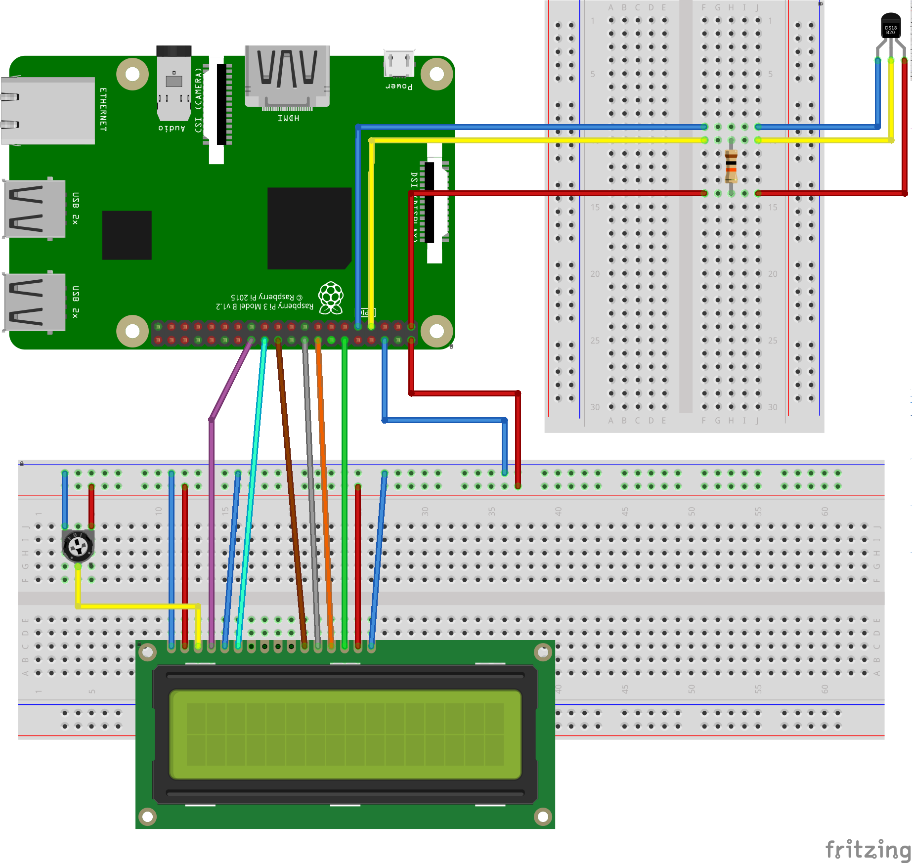

# airtemp-lcd

## About

This program uses a DS18B20 waterproof temperature sensor to monitor the air temperature
and display it in an HD44780 LCD 16x2 display.

## Software

Developed using the [Wiring Pi](http://wiringpi.com/) GPIO interface library.

## Hardware

 - Raspberry Pi 3 Model B Rev 1.2
 - DS18B20 1-Wire (Waterproof) Temperature Sensor
 - Hitachi HD44780 LCD 16x2 display
 - 10kΩ (kohm) resistor
 - 10kΩ (kohm) trimmer potentiometer (max resistance)
 - Jumper wires

## Breadboard view

The 4-bit mode has been selected for the LCD display.



## Configuration

Edit ```airtemp-lcd.c``` and set the value of the ```SENSOR_ID``` macro definition
to the corresponding ID of your sensor (e.g. ```#define SENSOR_ID 28-04146dd116ff```).

## Installation/Uninstallation

```bash
root@rpi3 ~ $ cd wiringpi-projects/airtemp-lcd
root@rpi3 ~ $ make            # Compile airtemp-lcd.c to airtemp-lcd.elf
root@rpi3 ~ $ make install    # Install the .elf file under /root/bin/
root@rpi3 ~ $ make uninstall  # Remove the .elf file from /root/bin/
root@rpi3 ~ $ make clean      # Remove the .elf file from current dir
```

The ```make``` and ```make install``` targets will respectively compile ```airtemp-lcd.c```
and install ```airtemp-lcd.elf``` (compilation product) under ```/root/bin/```. In case you
want to choose a different directory modify the content of variable ```TARGETDIR``` in
```Makefile```.

## Execution using Crontab

`Crontab` allows you to automatically execute a comand or a shell script at given intervals.

Run `crontab -e` to edit current crontab file. The very first time you will be prompted to choose the editor of your choice.

Assuming that you didn't modify the installation dir, add the following entry at the end of the file:
```bash
@reboot /root/bin/airtemp-lcd.elf
```
in order for ```airtemp-lcd.elf``` to be executed every time the raspberry pi boots. Save changes and exit.

